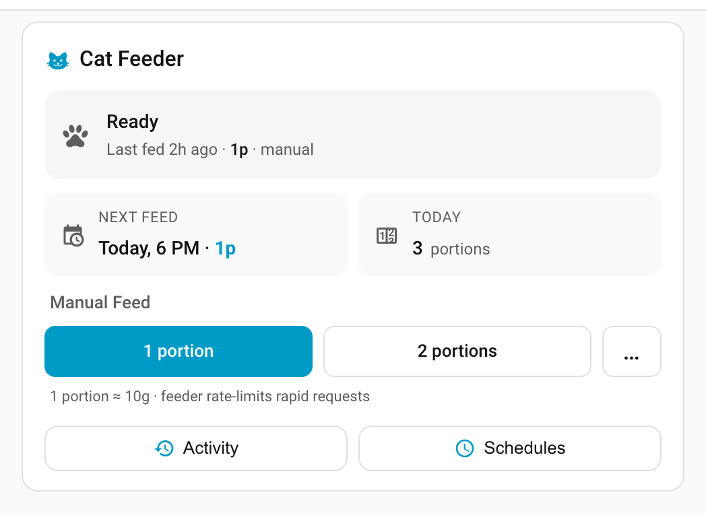
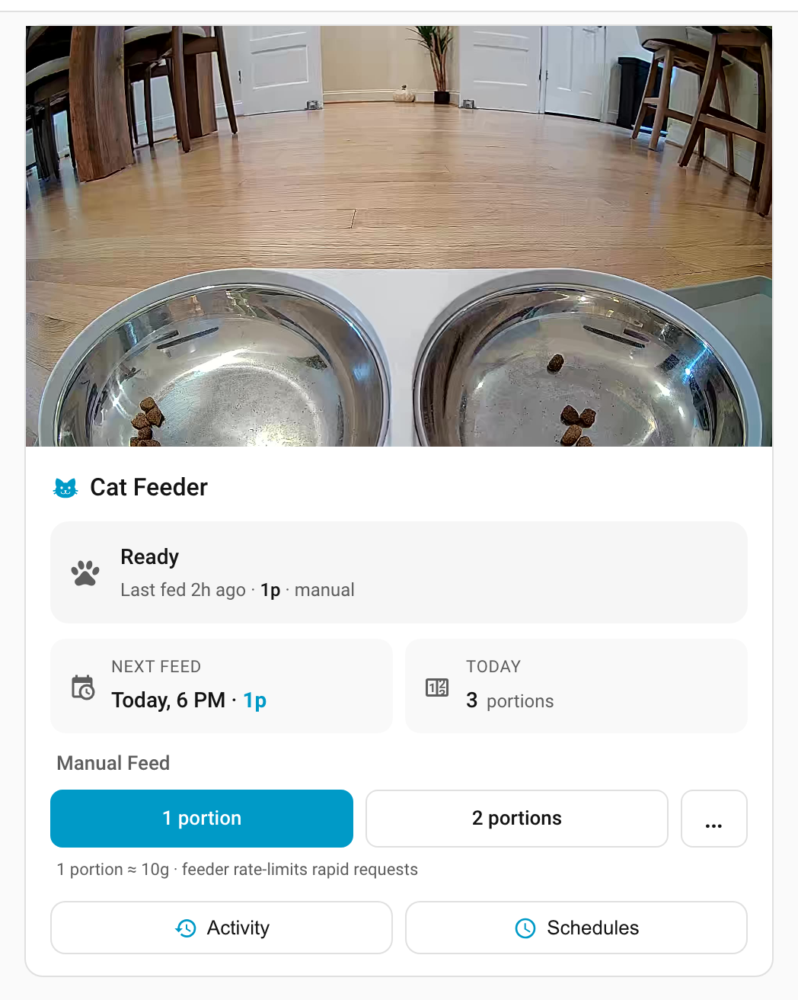
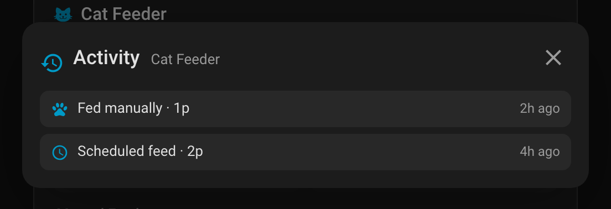
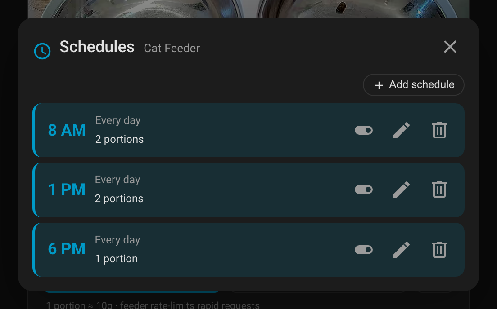

<p align="center">
  
</p>

# PetLibro Lite — Home Assistant integration

[![hacs][hacs-badge]][hacs-url]
[](https://github.com/louis-thiery/ha-petlibro-lite/actions/workflows/hassfest.yml)
[](https://github.com/louis-thiery/ha-petlibro-lite/actions/workflows/tests.yml)
[](LICENSE)
[](https://www.python.org/)

<p align="center">
  
</p>

Home Assistant integration for **already-paired PetLibro smart feeders that use the _PetLibro Lite_ mobile app** — the Tuya-whitelabel cousin of the main PetLibro app. Developed against a PLAF203; other models on the same stack should work but have not all been verified.

> **Is this the integration I want?**
>
> - ✅ You use the **PetLibro Lite** mobile app.
> - ✅ Your feeder is already paired and working on your home Wi-Fi.
>
> If you use the regular **PetLibro** app, this is not your integration — see [jjjonesjr33/petlibro](https://github.com/jjjonesjr33/petlibro) (community) instead. The two apps speak different cloud APIs.

## Features

One sign-in, everything included:

- Manual feed (1–50 portions)
- Schedule list: add / update / remove / replace
- Master on/off, food-level + state sensors, warning sensor, last-manual / last-scheduled timestamps
- `sensor.*_next_feed` (timestamp), `sensor.*_portions_today` (running daily total), `binary_sensor.*_feeding_plan_active`
- Rolling feed + warning log persisted across HA restarts
- `petlibro_lite_feed` / `petlibro_lite_warning` events on the HA bus for automations + Logbook
- Live video: WebRTC → KCP → AES-CBC H.264 pulled from the feeder, transcoded to HLS via HA's `stream` component. Camera entity exposes a `stream_state` attribute so UIs can render a "Connecting…" overlay during handshake, and auto-retries on auth failure (matches the app's own retry behavior).

After setup, LAN control runs entirely offline. The cloud session is only used at runtime for the WebRTC signaling that starts a video stream.

## Included Lovelace card

A minimal `custom:petlibro-feeder-card` is bundled and auto-registered as a Lovelace resource when the integration loads. It's designed to be useful out of the box:

- Pet-themed layout with camera thumbnail + animated connecting overlay
- 1 / 2 / 3 portion "Feed now" buttons
- "Next feed" + "Portions today" glance summary
- Activity dialog (feed + warning log) and Schedules dialog (edit slots)

<p align="center">
  
  
</p>
<p align="center">
  
  
</p>

The card ships as a single working config — if you want something fancier, fork the card, build your own, or drop the entities into any layout you like. I use a [custom React dashboard](https://github.com/louis-thiery/ha-dashboard) for my own home and the included card mirrors a subset of that UX, so expect the bundled card to stay simple and the heavy experimentation to happen in my private dashboard.

## Installation

### Via HACS (recommended)

1. In HACS → Integrations → ⋮ → **Custom repositories**, add `https://github.com/louis-thiery/ha-petlibro-lite` (category: **Integration**).
2. Install **PetLibro Lite** and restart Home Assistant.
3. **Settings → Devices & Services → Add Integration → PetLibro Lite**.

The bundled Lovelace card is auto-registered at `/petlibro_lite_static/petlibro-feeder-card.js` — no separate HACS "Lovelace" install required.

### Manual

Copy `custom_components/petlibro_lite/` into your HA `config/custom_components/` directory and restart.

## First-time setup

Only thing required: your **PetLibro Lite mobile app email + password**.

**Settings → Devices & Services → Add Integration → PetLibro Lite.**

The integration signs into Tuya's whitelabel cloud with those credentials, runs a LAN UDP scan to find your feeder, and calls `tuya.m.device.get` once per discovered device to pull the `localKey`. It then derives the P2P admin hash needed for live video from the same cloud session — no manual capture, no separate setup step.

If you have multiple feeders, you'll see a picker. If your router blocks UDP broadcast or the feeder is on a different subnet, there's a "LAN IP" field on the follow-up step that skips scanning.

If video stops working later (e.g. the cloud session expired), open **Settings → Devices & Services → PetLibro Lite → Configure** and sign in again — the admin hash is refreshed automatically.

> Note: this integration depends on the [`tinytuya`](https://github.com/jasonacox/tinytuya) Python library but handles discovery itself — you don't need to run `tinytuya wizard` yourself. And **it's unrelated to the LocalTuya HACS integration**, despite the similar name.

## Entities (per feeder)

| Platform | Entity | What |
|---|---|---|
| sensor | `sensor.<name>_state` | standby / feeding |
| sensor | `sensor.<name>_food_level` | full / low / empty |
| sensor | `sensor.<name>_warning` | ok / outlet_blocked / … (edge-tracked, stale-guarded across restarts) |
| sensor | `sensor.<name>_last_manual_feed` | timestamp + portions (attrs) |
| sensor | `sensor.<name>_last_scheduled_feed` | timestamp + portions (attrs) |
| sensor | `sensor.<name>_next_feed` | next upcoming enabled schedule as a timestamp (+ portions / slot index attrs) |
| sensor | `sensor.<name>_portions_today` | running daily portion total (resets at local midnight) |
| sensor | `sensor.<name>_feed_log` | rolling feed + warning history, persisted across HA restarts (attrs) |
| sensor | `sensor.<name>_schedules` | list of slots (attrs) |
| binary_sensor | `binary_sensor.<name>_feeding_plan_active` | true iff any enabled schedule slot exists |
| number | `number.<name>_feed_portions` | 1–50 |
| button | `button.<name>_feed_1` / `_feed_2` / `_feed_3` | one-tap quick feeds |
| switch | `switch.<name>_master` | device master on/off |
| switch | `switch.<name>_schedule_<N>` | per-slot enable toggle (dynamic) |
| camera | `camera.<name>_camera` | live HLS when P2P hash configured |

## Services

- `petlibro_lite.feed` — dispense N portions
- `petlibro_lite.schedule_add` / `schedule_update` / `schedule_remove` / `schedule_set_all`
- `petlibro_lite.refresh_state` — force an immediate LAN poll (useful from dashboard cards before showing fresh data)

See `custom_components/petlibro_lite/services.yaml` for the exact schemas.

## Lovelace card config

```yaml
type: custom:petlibro-feeder-card
feed_number: number.cat_feeder_feed_portions        # required
name: Cat Feeder                                    # optional
portions: [1, 2, 3]                                 # optional
state_sensor: sensor.cat_feeder_state
food_level_sensor: sensor.cat_feeder_food_level
warning_sensor: sensor.cat_feeder_warning
last_manual_sensor: sensor.cat_feeder_last_manual_feed
last_scheduled_sensor: sensor.cat_feeder_last_scheduled_feed
next_feed_sensor: sensor.cat_feeder_next_feed       # shows Next Feed summary
portions_today_sensor: sensor.cat_feeder_portions_today  # shows today's total
feed_log_sensor: sensor.cat_feeder_feed_log         # enables Activity dialog
schedules_sensor: sensor.cat_feeder_schedules       # enables Schedules dialog
device_id: <tuya_device_id>                         # required for schedule edits
camera_entity: camera.cat_feeder_camera             # optional
```

## Development

```sh
# python unit tests
uv sync
uv run pytest

# build the Lovelace card (esbuild → single ESM bundle, ~45 KB)
cd lovelace-card && npm install && npm run build
```

The build script outputs `lovelace-card/dist/petlibro-feeder-card.js` and copies it to `custom_components/petlibro_lite/www/` (where the integration's static-path serves it).

## Credits

Developed with [Claude Opus 4.7](https://www.anthropic.com/claude) assisting throughout, especially on the Tuya-whitelabel protocol work, the WebRTC/KCP/AES video pipeline, and the Lovelace card.

Upstream:

- [tinytuya](https://github.com/jasonacox/tinytuya) — LAN transport for the non-video DP work
- [aioice](https://github.com/aiortc/aioice) — ICE agent for the video handshake
- Home Assistant core + the `stream` / `ffmpeg` integrations — HLS transcoding

## License

[MIT](./LICENSE).

[hacs-badge]: https://img.shields.io/badge/HACS-Custom-orange.svg
[hacs-url]: https://github.com/hacs/integration
