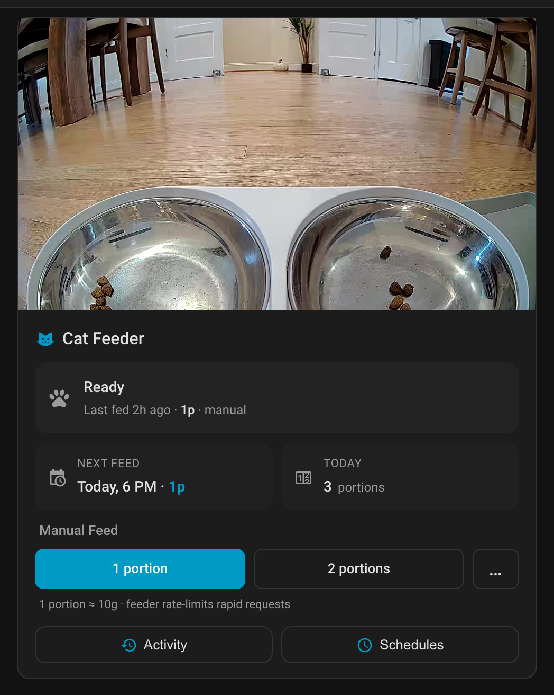

  

PetLibro Lite is a Home Assistant integration for **already-paired** PetLibro smart feeders (PLAF203 and other models that use the **PetLibro Lite** mobile app — the Tuya-whitelabel one). Setup is just your PetLibro Lite email + password; everything else — feeding, schedules, sensors, live camera — is derived automatically.

**This is not a replacement for the popular `petlibro` community integration.** Feeders that use the main "PetLibro" app use a different cloud API and need that integration instead. This integration is for the subset of feeders on the "Lite" Tuya-whitelabel stack.

Initial pairing must be done with the PetLibro Lite mobile app — this integration cannot onboard a factory-fresh feeder. Once the feeder is paired and on your Wi-Fi, the integration auto-discovers it over LAN and pulls the `local_key` + P2P admin hash from the PetLibro cloud for you. Manual LAN IP entry is available as a fallback for networks where UDP broadcast discovery fails (e.g., HAOS VMs, multi-subnet).

See the README for supported features and reconfigure instructions.
